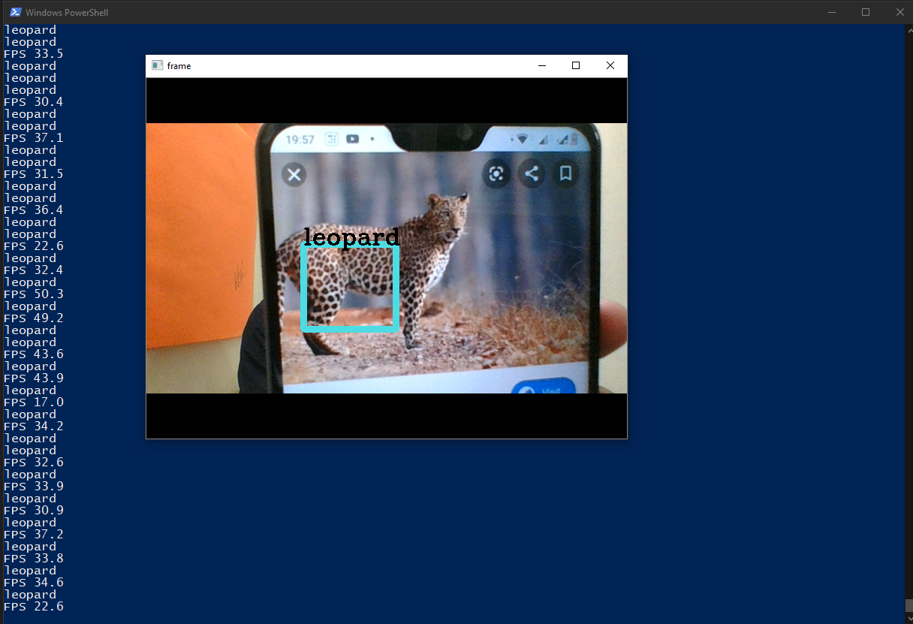

# LeopardEye: AI-Powered Leopard Detection Model 🐆

LeopardEye is a high-precision, real-time animal monitoring and detection system specifically designed to identify leopards. Built with a two-stage AI pipeline, it combines the speed of YOLO11 with the verification power of MobileNetV3 to ensure zero false positives in wildlife monitoring.

## 🌟 Key Features
- **Two-Stage AI Pipeline**: Uses YOLO11 for initial animal detection and MobileNetV3 (ImageNet) for surgical leopard verification.
- **Instant Camera Launch**: Pre-loads models in the background for zero-latency detection startup.
- **Premium Web Interface**: A cinematic, Netflix-inspired dashboard to control the detection system.
- **Audio Alerts**: Instant audible notifications when a leopard is confirmed.
- **Motion Sharpness**: Integrated sharpening filters to maintain accuracy even with motion-blurred camera feeds.

## 🚀 Quick Start

### 1. Install Dependencies
```bash
pip install flask flask-cors pillow torch torchvision ultralytics opencv-python numpy
```

### 2. Run the Application
Start the Flask server:
```bash
python app.py
```

### 3. Access the Dashboard
Open your browser and navigate to:
**[http://127.0.0.1:5000](http://127.0.0.1:5000)**

Click **Start Detection** to begin monitoring!

## 🛠 Technology Stack
- **AI Models**: YOLO11 (Ultralytics) + MobileNetV3 (Small)
- **Backend**: Flask (Python)
- **Frontend**: Vanilla HTML5, CSS3, JavaScript
- **Computer Vision**: OpenCV
- **Deep Learning**: PyTorch

## 📊 Motivation
This project was developed to enhance campus safety at IIITDM Jabalpur, which borders the Dumna Nature Reserve. The system provides real-time alerts to protect residents from leopard encounters by monitoring boundary walls and frequented areas.

## 📸 Screenshots
<p align="center">
  
</p>

## 📜 License
This project is licensed under the GNU General Public License v2.0.

---
**Developed by [hmbendale21](https://github.com/hmbendale21)**
